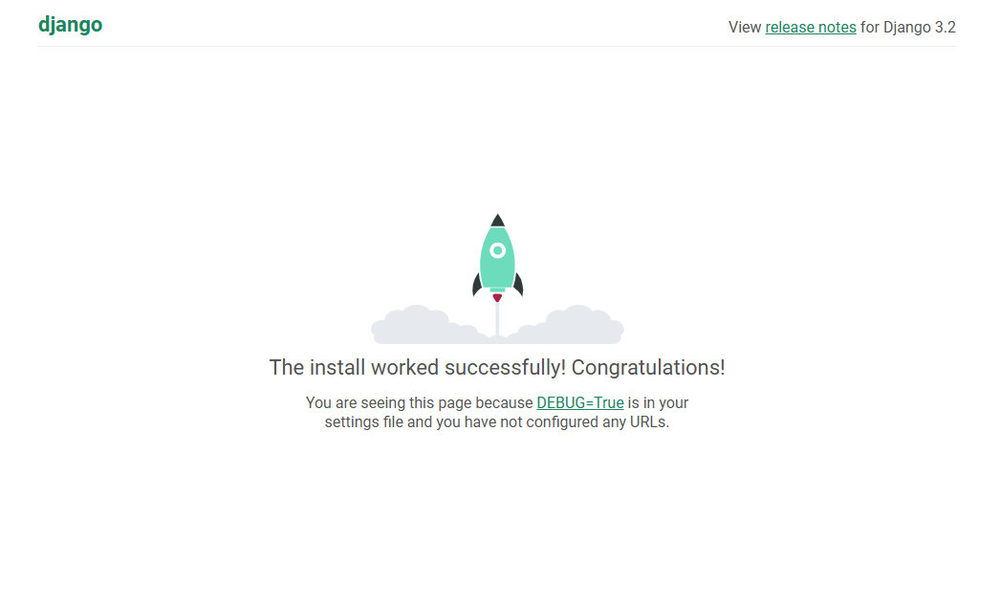

# DEPLOYMENT

This is where my deployment process will be documented.

## Install Django and packages, Create Django Project.

Install django
- *pip3 install 'django<4'*
- Django 3.2 is the LTS (Long Term Support) version of Django and is therefore preferable to use over the newest Django 4

Create Django project
- *django-admin startproject drf_api .*
- The dot at the end is important for creating it in the current directory

To use Cloudinary for Profile Pictures install cloudinary storage.
- *pip install django-cloudinary-storage*

For image processing capabilities use Pillow
- *pip install Pillow*
- Note the capital P.

The newly installed apps need to be added to settings.py in the django app.
The location of the files is important. django.contrib.staticfiles needs to be inbetween cloudinary_storage and cloudinary.

INSTALLED_APPS = [
'django.contrib.admin',
'django.contrib.auth',
'django.contrib.contenttypes',
'django.contrib.sessions',
'django.contrib.messages',
'cloudinary_storage',           <-----
'django.contrib.staticfiles',
'cloudinary',                   <-----
]

Next, we need to set up the Cloudinary environment variable.
- Create an env.py file at the top directory
- inside env.py add:

import os
os.environ['CLOUDINARY_URL'] = '<Your cloudinary api key>'

In settings.py, load the environment variable with the cloudinary credentials.

from pathlib import Path
import os                        <-----

if os.path.exists('env.py'):     <-----
    import env                   <-----

CLOUDINARY_STORAGE = {           <-----
'CLOUDINARY_URL' : os.environ.get('CLOUDINARY_URL')   <-----
}                                <-----
MEDIA_URL = '/media/'            <-----
DEFAULT_FILE_STORAGE = 'cloudinary_storage.storage.MediaCloudinaryStorage'   <-----

## Running server and allowing hosts

To run the server use
- *python3 manage.py runserver*

A disallowed host message will come up. Copy the HTTP_host header into allowed hosts in settings.py.
Reopen the server and you will see:

    

## Installing Django Rest Framework

Use command 
- *pip install djangorestframework

Then add to installed apps in settings.py

INSTALLED_APPS = [
    'django.contrib.admin',
    'django.contrib.auth',
    'django.contrib.contenttypes',
    'django.contrib.sessions',
    'django.contrib.messages',
    'cloudinary_storage',
    'django.contrib.staticfiles',
    'cloudinary',
    'rest_framework',    <------

    'profiles',
]

 