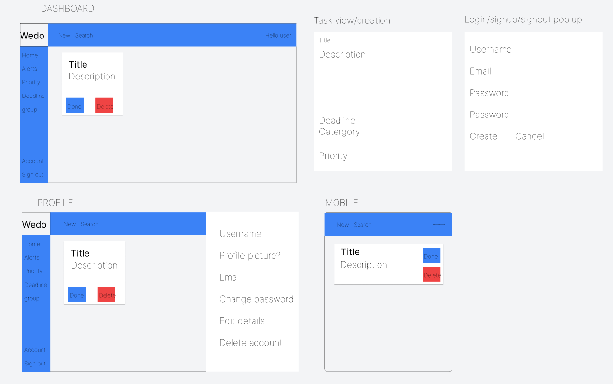

# README

## TABLE OF CONTENTS 
    1. Introduction

    2. UX
        - User Stories

    3. Features
        - Design Features
        - Existing Features
        - Future Adaptations

    4. Issues and Bugs

    5. Technologies Used
        - Main Languages Used
        - Frameworks, Libraries & Programs Used

    6. Testing
        - Testing.md

    7. Deployment
        - Deployment.md

    8. Credits
        - Content
        - People

    9. Acknowledgements

## INTRODUCTION

    Welcome to the To-Do Application! This app is a simple and intuitive task management tool designed to help you stay organized and boost productivity. Whether you need to manage your daily tasks, track ongoing projects, or set reminders, this application makes it easy to keep everything in one place.

    Built with Python, Django Rest, and React.js  this to-do app emphasizes ease of use and a clean user experience. Key features include:

    - Adding, editing, and deleting tasks.
    - Categorizing tasks into lists or groups.
    - Marking tasks as complete.
    - Viewing a summary of your progress.

    Perfect for both individuals and teams, the To-Do Application is lightweight, fast, and customizable to suit your needs. Get started today and take control of your tasks!

## UX

### User Stories

#### Account Management
    As a user, I can create an account so that I can save and manage my tasks.
    As a user, I can log in to my account so that I can access my tasks from anywhere.
    As a user, I can log out of my account so that I can keep my information secure.
    As a user, I can reset my password so that I can regain access if I forget it.
    As a user, I can update my account information so that I can keep my profile up to date.
    As a user, I can delete my account so that I can remove all my data from the application.
    As a user, I can receive an email confirmation after creating an account so that I know my registration was successful.
    As a user, I can be notified of login errors so that I can correct any mistakes and log in successfully.
#### General Users
    As a user, I want to create a new task, so that I can track what I need to accomplish.
    As a user, I want to edit an existing task, so that I can update its details if things change.
    As a user, I want to delete a task, so that I can remove tasks that are no longer needed.
    As a user, I want to mark a task as complete, so that I can see my progress.
#### Task Organization
    As a user, I want to categorize my tasks into different lists, so that I can keep related tasks grouped together.
    As a user, I want to set deadlines for tasks, so that I can manage my time effectively.
    As a user, I want to prioritize my tasks, so that I can focus on the most important ones first.
#### Visual and UX Enhancements
    As a user, I want to have a clean and intuitive interface, so that I can manage my tasks effortlessly.
    As a user, I want to view all my tasks in a list format, so that I can get an overview of what I need to do.
    As a user, I want to view completed tasks separately, so that I can reflect on what I’ve accomplished.
#### Advanced Features (Optional)
    As a user, I want to search for a specific task, so that I can quickly find what I’m looking for.
    As a user, I want to receive reminders for tasks with deadlines, so that I don’t miss anything important.
    As a user, I want to sync my tasks across devices, so that I can access them from anywhere.
#### Accessibility and Support
     As a user, I want the app to work on both desktop and mobile devices, so that I can use it in different scenarios.
     As a user, I want to have tooltips or a tutorial, so that I can understand how to use the app efficiently.

### Design Thinking 
This process has been documented separately in [AGILE.md](AGILE.md)

    Applying a Design Thinking approach, what features would users find most useful on the developed site? How feasible is it for an inexperienced student developer to deliver prioritised features given the time constraints of a hard deadline? As per assessment criteria, this project must utilise CRUD functionality. This provides a broad outline of what is needed. A brief though shower offered the following:

| **Feature**                       |**Importance**|**Feasability**|
|:----------------------------------|:------------:|:-------------:|
| Create personal account           | 5            | 5             |
| Update personal information       | 5            | 5             |
| Delete personal account           | 5            | 5             |
| Create a new task                 | 5            | 5             |
| Edit an existing task             | 5            | 5             |
| Delete an existing task           | 5            | 5             |
| Set deadline for task             | 4            | 5             |
| Set exisiting task as complete    | 4            | 5             |
| Cateragorize tasks                | 4            | 5             |
| Recieve reminders for tasks       | 3            | 4             |
| Task searchbar                    | 3            | 4             |
| Invite others to tasks            | 2            | 4             |
| **Overall score**                 | **50**       | **57**        |

    The above exercise indicates that overall importance/feasibility scores were similar.  Therefore the project should be deliverable.

### Colour Schema

    The color scheme for this task management app has been carefully selected to create a modern, intuitive, and calming user experience. The primary color, a soft blue, fosters focus and trust, making it ideal for headers and primary actions. Vibrant teal is used as an accent to draw attention to key elements without overwhelming the interface. Neutral tones like light grey and white maintain a clean and professional aesthetic, while dark grey text ensures excellent readability. Status colors such as green, amber, and red provide clear visual cues for task statuses, ensuring users can quickly identify completed, pending, and overdue tasks. This thoughtful palette not only enhances usability but also promotes an environment that encourages productivity and reduces cognitive load. Interactive elements feature subtle hover effects and focused states to improve user engagement and provide seamless feedback during interactions.

| **Category**                      | **Color**                      | **Reasoning**                                                                   |
|-----------------------------------|--------------------------------|---------------------------------------------------------------------------------|
| **Primary Colors**                |                                |                                                                                 |
| Base Color                        | Soft Blue (#3B82F6)            | Use for headers, buttons, and primary actions to mimic a focus-friendly design. |
| Accent Color                      | Vibrant Teal (#14B8A6)         | Ideal for highlighting important notifications, labels, or secondary actions.   |
| **Secondary Colors**              |                                |                                                                                 |
| Background                        | Light Grey (#F3F4F6)           | Clean and neutral, for the main app background.                                 |
| Panel/Section Background          | White (#FFFFFF)                | Keeps the interface uncluttered and professional.                               |
| Text Color                        | Dark Grey (#1F2937)            | For titles, subtitles, and general readability.                                 |
| **Status Colors**                 |                                |                                                                                 |
| Completed Tasks                   | Green (#10B981)                | Represents success and completion.                                              |
| Pending Tasks                     | Amber (#F59E0B)                | Adds a sense of urgency without being aggressive.                               |
| Overdue Tasks                     | Red (#EF4444)                  | Eye-catching but not overly harsh.                                              |
| **Hover & Interaction Effects**   |                                |                                                                                 |
| Button Hover                      | Slightly Darker Blue (#2563EB) | Adds a subtle feedback effect for interaction.                                  |
| Input Focus                       | Light Blue Border (#93C5FD)    | Ensures users easily recognize active input fields.                             |

### Database Design

    Entity Relationship Diagrams help to visualise database architecture before creating models in Django. Understanding the relationships between different tables can save time recoding later in the project.

| **Model**   | **Usage**                                                                                                      |
|-------------|----------------------------------------------------------------------------------------------------------------|
| **User**    | Django’s built-in authentication system, managing users and their permissions.                                 |
| **Profile** | Extends the User model to store additional user information like bio and location.                             |
| **Category**| Groups tasks for better organization, allowing users to categorize their tasks (e.g., Work, Personal).         |
| **Task**    | The central model of the app, representing individual tasks with details like status, priority, and deadlines. |

| **Model**   | **Field**             | **Type**                  | **Key**       | **Description**                                                                 |
|-------------|-----------------------|---------------------------|---------------|---------------------------------------------------------------------------------|
| **User**    | id                    | AutoField                 | PK            | Auto-incrementing primary key.                                                  |
|             | (default fields)      |                           |               | Default fields like username, email, and password provided by Django.           |
| **Profile** | id                    | AutoField                 | PK            | Auto-incrementing primary key.                                                  |
|             | user                  | OneToOneField(User)       | FK            | Links the profile to a single user.                                             |
|             | profile_picture       | ImageField                |               | Optional field to upload and store profile pictures.                            |
|             | bio                   | TextField                 |               | Optional short biography or user description.                                   |
|             | location              | CharField(max_length=255) |               | Optional field for storing the user’s location.                                 |
| **Category**| id                    | AutoField                 | PK            | Auto-incrementing primary key.                                                  |
|             | name                  | CharField(max_length=255) |               | Name of the category (e.g., Work, Personal).                                    |
|             | user                  | ForeignKey(User)          | FK            | Links category to the user who created it.                                      |
| **Task**    | id                    | AutoField                 | PK            | Auto-incrementing primary key.                                                  |
|             | title                 | CharField(max_length=255) |               | Short title of the task.                                                        |
|             | description           | TextField                 |               | Optional detailed description of the task.                                      |
|             | status                | CharField(choices)        |               | Tracks the current state (Pending, In Progress, Completed, Overdue).            |
|             | priority              | CharField(choices)        |               | Priority level of the task (Low, Medium, High).                                 |
|             | due_date              | DateTimeField             |               | Deadline for the task (optional).                                               |
|             | created_at            | DateTimeField             |               | Auto-generated timestamp when the task is created.                              |
|             | updated_at            | DateTimeField             |               | Auto-generated timestamp for the last update.                                   |
|             | user                  | ForeignKey(User)          | FK            | Links task to the user who created it.                                          |
|             | category              | ForeignKey(Category)      | FK            | Links task to a specific category. Can be null.                                 |

#### Skeleton
    Wireframes were made to showcase the appearance of the site pages while keeping a positive user experience in mind.

## Features
     Design Features
     Existing Featues
     Future Adaptations

## Issues and Bugs

## Technologies Used
     Main Languages Used
     Frameworks, Libraries & Programs Used

## Testing
This process has been documented separately in [TESTING.md](TESTING.md)

## Deployment
This process has been documented separately in [DEPLOYMENT.md](DEPLOYMENT.md)

## Credits
Content

[Figma](https://figma.com/) - For wireframes.

People

## Acknowledgements